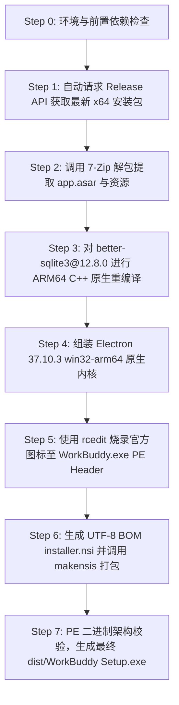

# WorkBuddy Windows ARM64 原生构建指南

本指南面向开发者，介绍如何使用自动化脚本构建**原生运行于 Windows ARM64 (Snapdragon X 平台/Surface Pro/Lenovo Yoga/Qualcomm 架构)** 的 WorkBuddy 桌面客户端。

---

## 目录
1. [系统环境与依赖准备](#系统环境与依赖准备)
2. [一键全自动构建步骤](#一键全自动构建步骤)
3. [构建流程原理详解](#构建流程原理详解)
4. [常见问题排查与 FAQ](#常见问题排查与-faq)

---

## 系统环境与依赖准备

在运行构建脚本前，请确保您的编译设备（建议在 Windows ARM64 或 Windows x64 设备）满足以下前置条件：

### 1. 软件依赖清单

| 依赖软件 | 建议版本 | 说明 | 安装方式 |
| :--- | :--- | :--- | :--- |
| **Python** | 3.8 或更高版本 | 运行自动化构建调度脚本 | [Python 官网下载](https://www.python.org/downloads/) |
| **Node.js** | 18.0 或更高版本 | 用于原生 C++ 插件重编译与图标烧录 | [Node.js 官网下载](https://nodejs.org/) |
| **C++ 编译工具** | Visual Studio 2022 / Build Tools | 编译 `better-sqlite3` 原生 C++ 插件 | 安装 VS Build Tools 勾选 `C++ 桌面开发` |
| **7-Zip** | 21.0 或更高版本 | 解压 x64 原包中的 `app-64.7z` | [7-Zip 官网下载](https://www.7-zip.org/) |
| **NSIS** | 3.0 或更高版本 | 编译输出 Windows 安装程序 `.exe` | 安装 NSIS 并将其 `makensis.exe` 添加到环境变量 PATH |

---

## 一键全自动构建步骤

### 1. 克隆 / 下载项目目录

打开 PowerShell 或终端，进入项目根目录：
```powershell
cd c:\Developer\Personal\workbuddy-windowsarm64
```

### 2. 执行一键构建命令

#### 方式一：双击或直接运行批处理脚本（推荐）
直接双击运行目录下的 **`build.bat`**，控制台将交互式询问代理端口：
- **输入端口号**（例如输入 `7890`）：脚本将自动使用 `http://127.0.0.1:7890` 代理拉取 Github/npm 资源；
- **直接按回车**：不配置代理，直接使用网络直连模式进行构建。

```cmd
build.bat
```

#### 方式二：命令行直接运行 Python 脚本
```powershell
python build_workbuddy_arm64.py
```
如需显式指定代理端口：
```powershell
python build_workbuddy_arm64.py --proxy http://127.0.0.1:7890
```

---

## 构建流程原理详解

脚本会自动按顺序完成以下 7 个核心阶段：



### 核心阶段说明：
1. **自动检测与下载最新版**：
   脚本通过调用 `https://www.workbuddy.cn/v2/update?platform=workbuddy-win32-x64-user` 实时获取最新版本号与官方 `.exe` 安装包下载链接。
2. **`better-sqlite3` 针对性 C++ 编译**：
   WorkBuddy 5.x 依赖 `better-sqlite3@12.8.0` 特有的 C++ 导出 API (`addon.setErrorConstructor`)。脚本自动在 ARM64 环境下针对 Electron 37.10.3 执行 `@electron/rebuild`，彻底消除白屏隐患。
3. **PE Header 二进制图标烧录**：
   使用 `rcedit` 深度重写 `WorkBuddy.exe` 的 Win32 资源头，将 WorkBuddy 官方高清 LOGO 直接写进二进制文件内部，解决桌面与任务栏图标变成 Electron 蓝图 atom 标识的问题。
4. **防锁死与无乱码打包**：
   生成的 NSIS 脚本自带 UTF-8 BOM Header 与静默进程清理策略（`taskkill /F /T /IM WorkBuddyRepair.exe`），保障覆盖安装 100% 成功。

---

## 常见问题排查与 FAQ

### 1. 打包提示 `makensis.exe not found`？
- **解决**：请安装 NSIS 并确保 `makensis.exe` 已加入系统 Path 环境变量；或安装过 `electron-builder` 的系统会自动从 `%LOCALAPPDATA%\electron-builder\Cache\nsis\` 缓存目录自动读取。

### 2. 编译 `better-sqlite3` 提示 `gyp ERR! find Python / VS`？
- **解决**：请确保安装了 Visual Studio C++ 桌面开发工作负载，并在 PowerShell 中运行：
  ```powershell
  npm config set msvs_version 2022
  ```

### 3. 安装时提示“不能打开要写入的文件”？
- **解决**：说明后台残留了之前运行的 `WorkBuddy.exe` 或 `WorkBuddyRepair.exe`。构建出来的最新安装包已内置自动进程清理逻辑，双击新安装包即可自动清理并覆盖安装。
